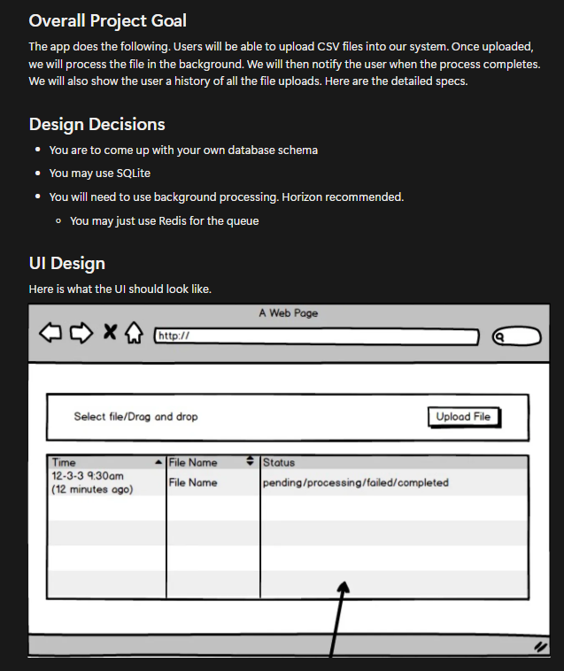
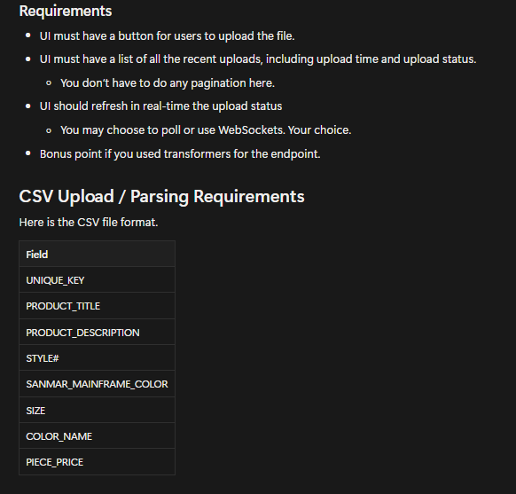
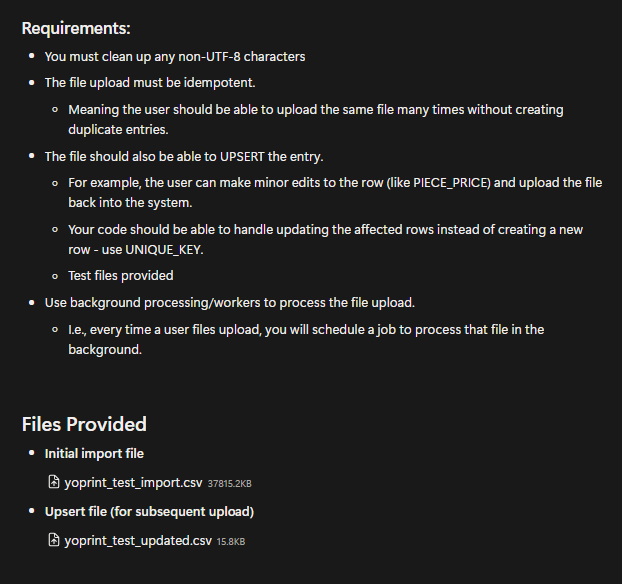

# YoPrint Exercise

Tech Stacks:

Note: Im using WSL for Development (Horizon unsupported in Window)

- PHP 8.3
- Node v22
- Laravel 11
- Vite with NPM
- Blazer
- PostgreSQL (Need Download)
- Redis (Need Download)

Packages:
- Reverb (Broadcasting)
- Redis (Queue)
- Horizon (Queue Monitoring)

## Exercise Instrustion





## Setting Up

1. Install PostgreSQL (CLI/GUI)
2. Create Database Named: yo_print_exercise
3. Paste .env.example to .env file (Create .env file if doesn't exist)
4. Adjust .env file as needed (DB Username, Password etc.)
5. Run Command
```bash
php artisan migrate
```
or else (Clean and Remigrate upon Failure)
```bash
php artisan migrate:fresh
```
6. To ensure the frontend works, execute: 
```bash
npm install
```
If Fails try:
```bash
npm install --legacy-peer-deps
```

## Testing (Multiple Terminal Required, could use something like tmux etc.)

- Terminal 1: Vite Dev Server
```bash
npm run dev
```
- Terminal 2: Laravel Development Server
```bash
php artisan serve
```
- Terminal 3: Reverb WebSocket Server
```bash
php artisan reverb:start
```
- Terminal 4: Horizon Queue Worker
```bash
php artisan horizon
```

Visit:
```bash
http://localhost:8000
```
```bash
http://localhost:8000/horizon
```
<br>

---

(Optional)

Switching the Max Size in PHP Note:
```bash 
sudo nano /etc/php/8.3/cli/php.ini
```
Switch `upload_max_filesize | post_max_size` to relevant value.


## Steps to Use:
1. Press on the upload file column / drag a file into the upload file column
2. Press on the upload file button
3. Wait for Processing